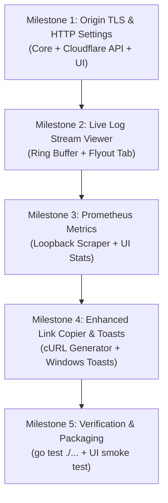

# QuickFlare Phase 1 (P1) Implementation Plan

> **Scope**: 5 high-impact, low-blast-radius features focusing on **Observability, Developer Experience, and Diagnostics**.  
> **Philosophy**: Standard library first, zero data-path interception, no bloat, preserving all battle-tested platform invariants.

---

## 1. Feature Breakdown & Architecture

### Feature 1: Advanced Origin TLS & HTTP Settings (`originRequest`)
* **Value**: Unblocks developers running local servers with HTTPS (Vite, Next.js, mkcert self-signed certs) and virtual hosts requiring custom `Host` headers.
* **Target Files**:
  - `internal/cloudflare/tunnel.go`: Extend `OriginRequest` with `NoTLSVerify`, `HTTPHostHeader`, `OriginServerName`, `Http2Origin`.
  - `internal/core/route.go`: Add `OriginSettings` to domain model `Route`.
  - `internal/config/config.go`: Serialize origin settings in `config.json`.
  - `internal/ui/views.go`: Add expandable "Advanced Origin Settings" section in Add/Edit route modal.
* **Invariants**:
  - Cloudflare remotely-managed tunnel API requires whole-document replacement (`PutTunnelConfig` under `ingressMu`).
  - Default values must be zero-values (`NoTLSVerify: false`) to prevent accidental insecurity unless explicitly opted in.

### Feature 2: `cloudflared` Live Log Stream Viewer
* **Value**: Instant in-app visibility into connection errors, route rejections, and TLS handshakes without digging into `%LOCALAPPDATA%` logs.
* **Target Files**:
  - `internal/supervisor/cloudflared.go`: Connect `t.Logs()` stream to an in-memory ring buffer (500 lines).
  - `internal/supervisor/logs.go`: Thread-safe circular ring buffer with mutex protection and slice export.
  - `internal/ui/panel.go` & `internal/ui/views.go`: Add a "Logs" modal/tab in the flyout with search filter, level color coding, and a "Copy All" button.
* **Invariants**:
  - Reading logs must be completely non-blocking: lines dropped if buffer/consumer is full (already enforced by `select { case t.logs <- line: default: }`).
  - No disk I/O for the in-memory UI ring buffer.

### Feature 3: Prometheus Metrics & Health Diagnostics
* **Value**: Real-time traffic visibility: active connections, requests served, status code counts, without intercepting network packets.
* **Target Files**:
  - `internal/supervisor/cloudflared.go`: Extend existing poller (which already hits `/ready`) to query `/metrics`.
  - `internal/supervisor/metrics.go`: Lightweight standard library parser for Prometheus metrics (`cloudflared_tunnel_total_requests`, `cloudflared_tunnel_response_by_code`, `cloudflared_tunnel_ha_connections`).
  - `internal/ui/panel.go`: Display throughput / status pill in the UI header/footer.
* **Invariants**:
  - Zero external Prometheus client dependencies (custom ~80 line text scanner).
  - Must remain strictly read-only on loopback (`127.0.0.1:<metricsPort>`).

### Feature 4: Native Windows Toast Notifications
* **Value**: Notifies developers when a background tunnel drops, reconnects, or encounters a fatal token revocation.
* **Target Files**:
  - `internal/ui/notify_windows.go`: Thin Windows PowerShell XML toast / Win32 notification helper.
  - `internal/ui/notify_other.go`: No-op fallback for non-Windows platforms.
  - `internal/ui/panel.go`: Trigger toast on `supervisor.State` transitions (`StateReconnecting`, `StateFailed`, `StateConnected`).
* **Invariants**:
  - Debounced: notifications suppressed during frequent flapping (minimum 10s interval).
  - User-configurable toggle in Settings: "Show desktop notifications".

### Feature 5: Enhanced Link Copier
* **Value**: Saves developer time when testing newly published routes.
* **Target Files**:
  - `internal/ui/views.go`: Route action dropdown or secondary action:
    - Copy Public URL (`https://app.domain.com`)
    - Copy cURL Command (`curl -i https://app.domain.com`)
  - `internal/ui/panel.go`: Status bar toast feedback (`"Copied cURL command"`).

---

## 2. Implementation Order & Milestones

### Detailed Execution Steps

1. **Step 1: Core Domain & Cloudflare Ingress Settings**
   - Update `internal/core/route.go` with `OriginSettings`.
   - Update `internal/cloudflare/tunnel.go` `OriginRequest` struct and `AddRoute` / `UpdateIngress`.
   - Add unit tests in `internal/core/route_test.go` and `internal/cloudflare/tunnel_test.go`.

2. **Step 2: Add/Edit Route UI Expansion**
   - In `internal/ui/views.go`, add "Advanced Settings" fold in `viewAddRoute`.
   - Add checkboxes for `NoTLSVerify`, and optional text fields for `HTTPHostHeader`.
   - Persist settings to `config.json`.

3. **Step 3: Ring Buffer & Log Viewer**
   - Implement `LogRing` in `internal/supervisor/logs.go`.
   - In `internal/ui/panel.go`, subscribe to supervisor log ring buffer.
   - Add `viewLogs` in `internal/ui/views.go` with search filter and "Copy All".

4. **Step 4: Prometheus Metrics Poller**
   - Parse Prometheus key-value text lines from `/metrics`.
   - Update `Panel.tunnelStatus` with parsed metrics.
   - Show active streams / total requests in a clean UI badge.

5. **Step 5: Notifications & Link Copier**
   - Implement `notify_windows.go` toast dispatch.
   - Add "Copy cURL" action beside "Copy URL".
   - Test full flow: adding a self-signed HTTPS route, viewing live logs, checking metrics, and verifying clipboard copies.
